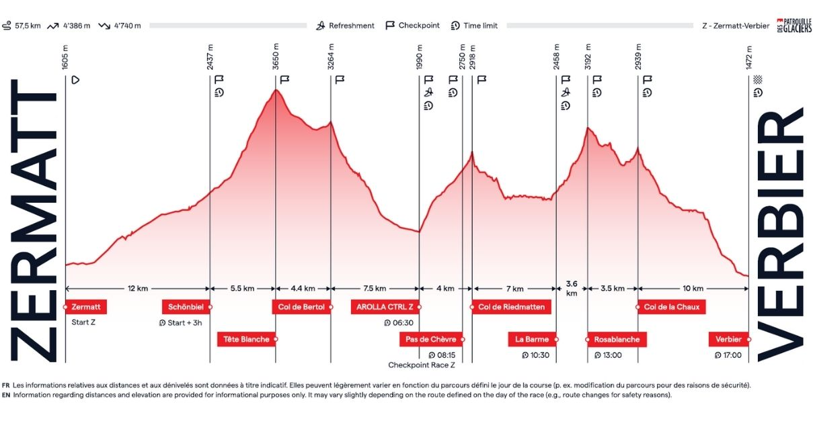

# Patrouille des Glaciers 2026

The authoritative source is https://live.pdg.ch.

Official results at https://www.mso.swiss/de/events/2378-patrouille-des-glaciers/results?type=SCRATCH&typeId=14966 

- [pdg2026-A1-Overall.csv](./data/pdg2026-A1-Overall.csv)
- [pdg2026-Z1-Overall.csv](./data/pdg2026-Z1-Overall.csv)
- [pdg2026-A2-Overall.csv](./data/pdg2026-A2-Overall.csv)
- [pdg2026-Z2-Overall.csv](./data/pdg2026-Z2-Overall.csv)

Downloading the links below and a little massaging to csv and xlsx...

- [pdg2026.csv](./data/pdg2026.csv)
- [pdg2026.xlsx](./data/pdg2026.xlsx)

provides intermediates and some more...

# Links

- https://www.mso.swiss/de/events/2378-patrouille-des-glaciers
- https://api-live.pdg.ch/races/
- https://api-live.pdg.ch/replay/races/Z1/keyframe?timestamp_lte=1776350873
- https://api-live.pdg.ch/replay/races/A1/keyframe?timestamp_lte=1776350049
- https://api-live.pdg.ch/replay/races/Z2/keyframe?timestamp_lte=1776519533
- https://api-live.pdg.ch/replay/races/A2/keyframe?timestamp_lte=1776522750

